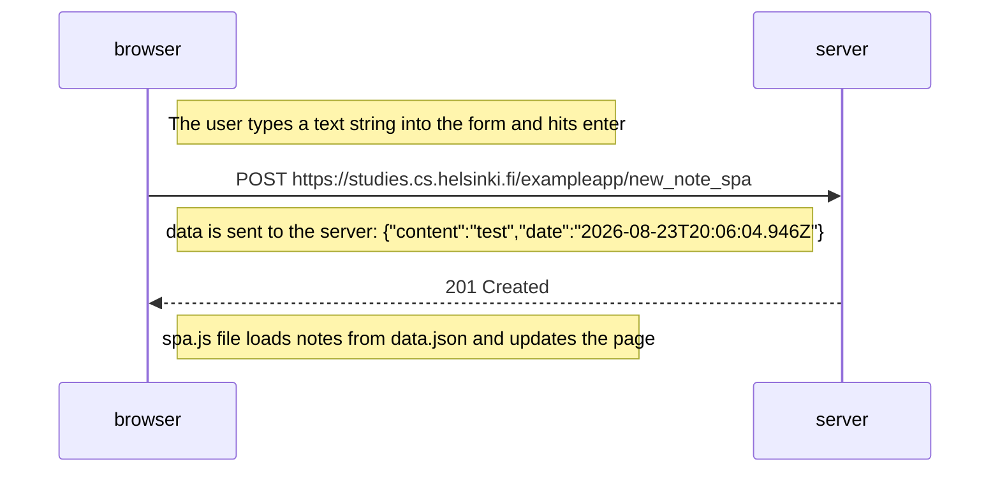

# Creation of a new note in single page app

```mermaid
sequenceDiagram
    participant browser
    participant server

    Note right of browser: The user types a text string into the form and hits enter

    browser->>server: POST https://studies.cs.helsinki.fi/exampleapp/new_note_spa
    Note right of browser: data is sent to the server: {"content":"test","date":"2026-08-23T20:06:04.946Z"}
    server-->>browser: 201 Created
    Note right of browser: spa.js file loads notes from data.json and updates the page
```
